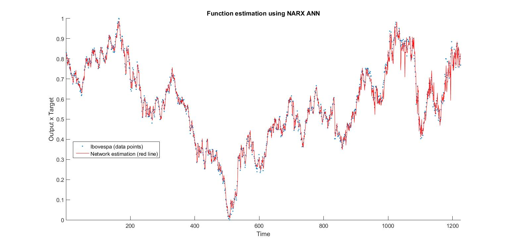
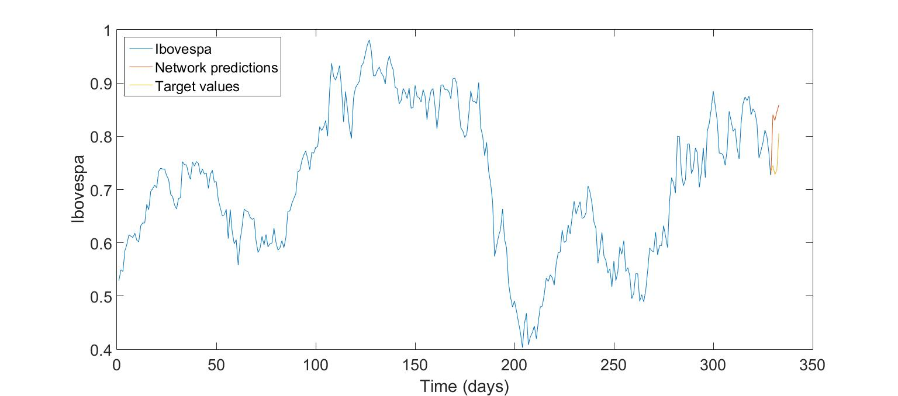
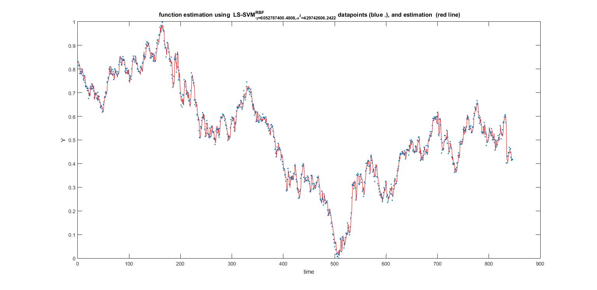

# Ibovespa forecast using NARX ANN and NARX LS-SVM
Ibovespa (Brazil's main stock exchange index) forecast using Nonlinear Autoregressive Exogenous Artificial Neural Network (NARX ANN) and Nonlinear Autoregressive Exogenous Least-Squares Support Vector Machine (NARX LS-SVM) for an university project, on MATLAB. 

## Model parameters and data
### Model parameters - NARX ANN
The Artificial Neural Network (ANN) was developed based on the *nnstart toolbox*, and then modified to adjust the script to this project goals. It has three layers, with 20 neurons in the hidden layer. The learning method used was the Levenberg-Marquardt algorithm. The MATLAB function used was *narxnet*.

### Model parameters - NARX LS-SVM
As for the least-squares support vector machines, the *LS-SVMlab v1.8 toolbox* (LS-SVM v.1.8, Suykens, Leuven, Belgium) (Suykens et al., 2011) is used. The chosen kernel was the gaussian radial basis function; the tuning parameters (gam and sig2) were found using leave-one-out crossvalidation and simplex was the optimization algorithm used.

### Data
The data was downloaded in B3's (Brazil's stock exchange) website, inside the [data service area](http://www.b3.com.br/pt_br/market-data-e-indices/servicos-de-dados/market-data/historico/mercado-a-vista/cotacoes-historicas/). The 27 assets that most represented the index were chosen to be fed into the models. The data was then detrended and normalized. Instead of the price, the daily traded volume of the assets was used.

## Images
**NARX ANN function aproximation**

**NARX ANN five steps-ahead prediction**

**NARX LS-SVM function aproximation**

## Toolboxes
Artificial neural network - MATLAB *nnstart toolbox*, *narxnet* function. See [1](https://www.mathworks.com/help/deeplearning/ref/narxnet.html;jsessionid=5b5122b79c6fe7cf55304351fe91) for *narxnet* and [2](https://www.mathworks.com/help/deeplearning/ug/design-time-series-narx-feedback-neural-networks.html) for Design Time Series NARX Feedback Neural Networks.   
Least-squares support vector machine - [*LS-SVMlab v1.8 toolbox*](https://www.esat.kuleuven.be/sista/lssvmlab/) (LS-SVM v.1.8, Suykens, Leuven, Belgium) (Suykens et al., 2011).
